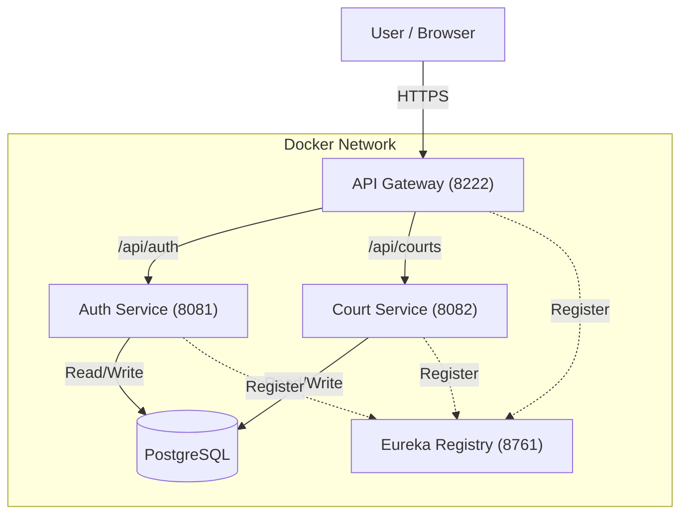

# 🏸 BadMintoz - Microservices Sports Booking Platform

**BadMintoz** is a full-stack microservices application designed to streamline badminton court reservations. Built with **Java Spring Boot**, **React**, and **PostgreSQL**, it demonstrates a modern, scalable cloud-native architecture.

---

## 🏗️ Architecture
The system follows a microservices pattern with a centralized API Gateway and Service Discovery.


* **Frontend:** React + TailwindCSS + Vite
* **Gateway:** Spring Cloud Gateway (Port 8222)
* **Discovery:** Netflix Eureka (Port 8761)
* **Services:**
    * 🔐 **Auth Service:** JWT Authentication, User Management.
    * 🏸 **Court Service:** Court management, Booking logic, Availability checks.
* **Database:** PostgreSQL (Containerized)
* **DevOps:** Docker Compose, GitHub Actions (CI/CD)

---

## 🚀 Key Features
* **User Authentication:** Secure Signup/Login with JWT (JSON Web Tokens).
* **Role-Based Access:** Securing endpoints for Users vs Admins.
* **Real-time Availability:** Prevents double-booking of slots.
* **My Bookings:** Personal dashboard for users to manage reservations.
* **Containerized:** Fully Dockerized for "One-Click" deployment.

---

## 🛠️ Tech Stack

| Category | Technology |
| :--- | :--- |
| **Backend** | Java 21, Spring Boot 3, Spring Data JPA, Hibernate |
| **Frontend** | React (TypeScript), Axios, TailwindCSS |
| **Database** | PostgreSQL |
| **Infrastructure** | Docker, Docker Compose, AWS (Pending) |
| **Testing** | JUnit 5, Mockito |

---

## 🏃‍♂️ How to Run Locally

### Prerequisites
* Docker & Docker Compose
* Java 21 (Optional, if running without Docker)

### 1. Clone the Repository
```bash
git clone [https://github.com/venkat353/badmintoz-monorepo.git](https://github.com/venkat353/badmintoz-monorepo.git)
cd badmintoz-monorepo
```

### 2. Start the Application
* We use Docker Compose to spin up the Database, Backend Services, and Frontend simultaneously.
```bash
docker-compose up -d
```
### 3. Access the App
* Frontend Dashboard: http://localhost:5173

* API Gateway: http://localhost:8222

* Eureka Dashboard: http://localhost:8761

### 🧪 Testing
* The project includes automated Unit Tests for the Service Layer.

* To run tests manually:
```bash
cd backend/court-service
mvn test
```

* CI/CD Pipeline is configured via GitHub Actions to run tests on every push.
### 📚 API Documentation
* The backend services are documented using Swagger / OpenAPI 3.
* Auth Service API: http://localhost:8081/swagger-ui/index.htmlCourt 
* Service API: http://localhost:8082/swagger-ui/index.html
* (Note: Ensure you are logged in or use the Gateway port 8222 with a Bearer token for protected endpoints)

### 🔮 Future Improvements (Roadmap)
* AWS Deployment: Hosting on ECS/EKS with RDS.
* Payment Gateway: Integration with Stripe/Razorpay.
* Admin Panel: UI for court owners to add/remove slots.